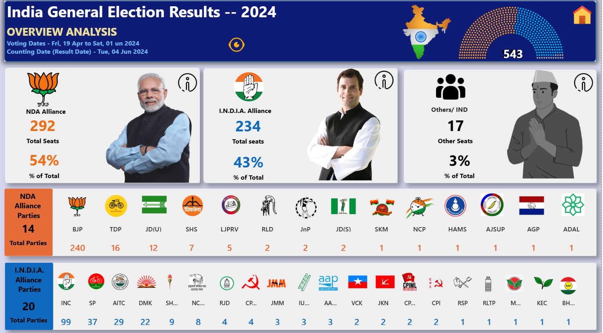
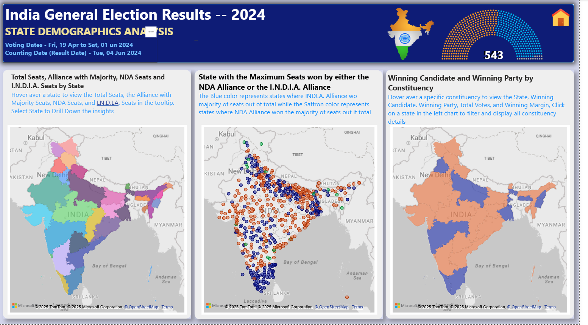
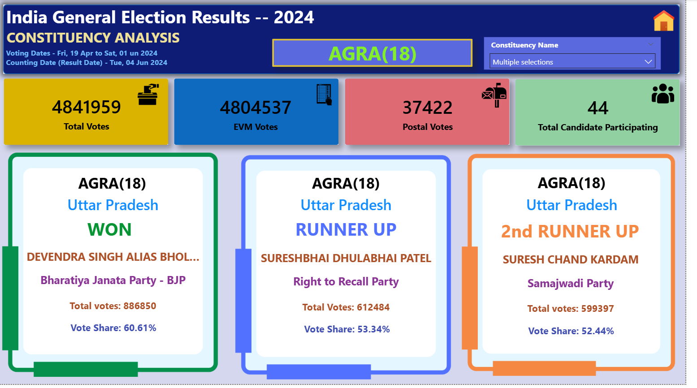

# Election_Report_of_2024
# 🇮🇳 Power BI Report – Indian Elections 2024

This repository presents a **comprehensive analysis of the Indian General Election Results 2024** using **Power BI, SQL, and Excel**.  
It includes interactive dashboards (with demo videos), SQL queries for deeper analysis, and the dataset used to build the report.

---

## 📊 Dashboards & Analysis

### 1. Overview Analysis Dashboard
Provides a high-level summary of the election results including total seats, party-wise distribution, and alliances performance.  

🎥 [Watch Video](Overview_analysis.mp4)
🖼️ Dashboard Preview:  

---

### 2. State Demographic Analysis
Shows state-wise and demographic breakdown of results with voter turnout insights and candidate performance.  

🎥 [Watch Video](State_Demographics_Analysis.mp4)  
🖼️ Dashboard Preview:  

---

### 3. Political Landscape Analysis
Highlights state-level performance by parties, seat share, and includes slicers for interactive filtering.  

🎥 [Watch Video](Political_Landscape.mp4)  
🖼️ Dashboard Preview:  

---

### 4. Constituency Analysis
Provides candidate-level insights including winning candidate, runner-up, and second runner-up with vote margins.  

🎥 [Watch Video](Constituency_Analysis.mp4)  
🖼️ Dashboard Preview:  

---

## 🗄️ SQL Queries
A collection of SQL queries used for analyzing election data such as:  
- Total seats per state  
- Alliance-wise seat distribution  
- Candidate-level analysis  
- EVM vs Postal vote breakdown  

📂 [View SQL Queries](SQL%20Queries.docx)  

---

## 📑 Dataset
The original Excel dataset used for cleaning and Power BI modeling is also included in this repository.  

📂 [Election Data (Excel)](data/election_data.xlsx)  

---

## 🛠️ Tools & Technologies
- **Power BI** – Data visualization & dashboard creation  
- **SQL** – Querying and extracting insights from datasets  
- **Excel** – Data cleaning and preparation  

---

## 🚀 Insights from the Analysis
- NDA and I.N.D.I.A. alliance dominance in different regions  
- Demographic turnout impact on results  
- Party-wise performance comparison across states  
- Candidate-level competitive insights  

---

## 👩‍💻 About Me
I’m **Himanshi Chaudhary**, a BBA student passionate about **Finance, Business Intelligence, and Data Analytics**.  
Through this project, I combined my skills in **Excel, SQL, and Power BI** to analyze real-world election data and build meaningful insights.  

🔗 [LinkedIn](https://linkedin.com) | 📧 chaudharyhimanshi29@gmail.com
